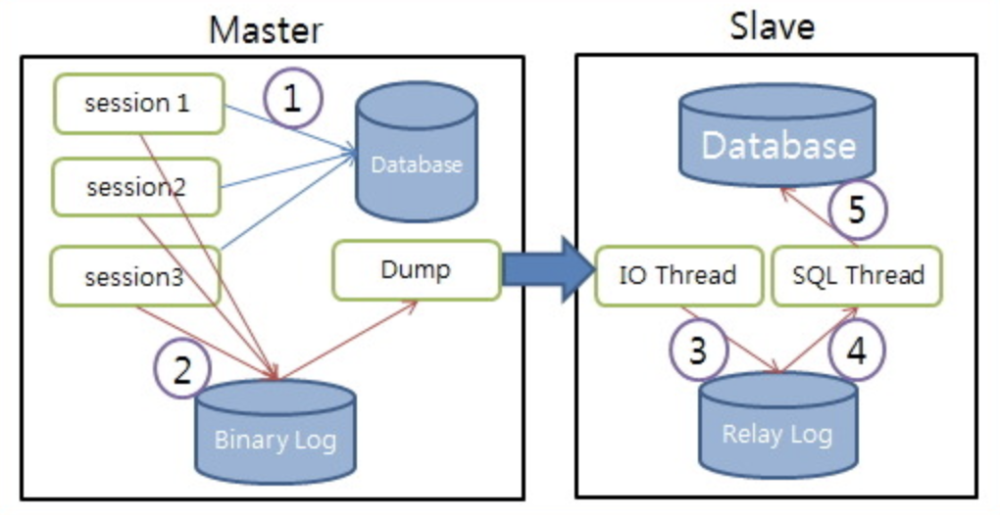

# [데이터베이스] binary log 란?

* binary log 에는 데이터베이스에 대한 모든 변경 사항(데이터 및 구조)과 각 명령문 실행 시간이 기록되어 있다.
* binary log 는 InnoDB 같은 스토리지 엔진에서 기록하는 Redo Log 와는 다른 별도의 로그이다.
* binary log 는 일련의 binary log 파일 집합과 index 파일로 구성된다.
* CREATE, ALTER, INSERT, UPDATE 및 DELETE와 같은 statement 는 기록되지만,
SELECT 및 SHOW와 같이 데이터에 영향을 미치지 않는 statement 는 기록되지 않는다.
* (성능 상 비용은 더 들지만)이를 기록하려면 general query log 를 사용해야 한다.
* __binary log 의 목적은 백업 작업을 지원할뿐만 아니라, 하나 이상의 마스터에서 하나 이상의 슬레이브 서버로
데이터가 전송되어 복제하도록 하기 위한 것이다.__
* binary log 는 암호를 포함한 민감한 정보를 포함할 수 있으므로 보호해야 한다.
이를 위해 binary log 는 일반 텍스트가 아닌 이진으로 저장되므로 일반 편집기로는 볼 수 없다.

## binary log 와 replication



* binary log 를 이용해 replication 하는 순서는 아래와 같다.
  * 1) Master 에서 데이터 변경작업이 일어나면, Master DB에 변경 실행
  * 2) 변경된 이력을 binary log 에 기록
  * 3) Slave의 IO Thread 가 Master의 변경 event를 감지하고, Master의 binrary log 를
  자신의 Relay log에 기록한다.
  * 4) Slave의 SQL Thread 는 Relay log 를 읽고 자신의 DB에 기록한다.
* 위 그림에서처럼 Master 에서 Slave 방향으로 단방향으로만 처리가 이루어 지므로 변경작업(Write)는 Master에만 하여야 한다.

## binary log 활성화

* __기본적으로 binary log 는 기록되지 않는다.__
* server 를 기동할 때 –log-bin[=name] 옵션을 주면 binary logging 이 활성화된다.
* 또는 mysql 설정파일에서 설정할 수도 있다. `log_bin = /var/log/mysql/mysql-bin.log`
* name option(절대 path)을 주지 않으면 다음 중의 한 이름으로 파일이 생성된다.
  * datadir/log-basename-bin
  * datadir/mysql-bin
  * datadir/mariadb-bin
* `datadir`는 system variable 설정에 따른다.
* binary log 파일이 저장되는 디렉토리에는 자동으로 binary log index 파일도 생성된다.
* binary log index 는 모든 binary log 들의 리스트를 순서대로 저장하고 있다.
* 기본적으로 binary log 파일의 이름과 동일한 이름에 .index 확장자가 붙어서 생성되며, 이름을 변경하고 싶은 경우 –log-bin-index[=filename] 옵션을 사용한다.

```
[root@dpleevbox mysql]# cat mariadb-bin.index
/var/log/mysql/mariadb-bin.000001
/var/log/mysql/mariadb-bin.000002
/var/log/mysql/mariadb-bin.000003
/var/log/mysql/mariadb-bin.000004
/var/log/mysql/mariadb-bin.000005
/var/log/mysql/mariadb-bin.000006
/var/log/mysql/mariadb-bin.000007
```

* `binary log` 파일의 이름 중 확장자는 자동으로 증가하는 숫자를 이용하여 만들어지는데,
다음의 경우에 새로운 파일이 생성된다.

## binary log format

* 변경 event 를 binary log 파일에 기록할 때 다음의 3 가지 format 을 지원한다.
  * Statement-based Logging
  * Row-based Logging
  * Mixed Logging
* 아마도 다음과 같은 상황일 경우 binary log 의 format 을 변경하는게 좋을 수 있다.
  * 하나의 Update 문이 다수의 row 를 변경할 경우 Statement-based Logging 이
   Row-based Logging 보다 slave 에서 download 시 효율적일 것이다.
  * 다수의 statement 가 row 변경을 거의 발생시키지 않을 경우, Row-based Logging 이
   Statement-based Logging 보다 slave 에서 download 시 효율적일 것이다.
  * Long-run Query 임에도 불구하고 실제 변경하는 row 는 극히 제한적일 경우
   Row-Based Logging 이 slave 에게는 효율적일 것이다.

## 관련 Command

* SHOW BINARY LOGS
  * 해당 서버에 있는 binary log 파일의 리스트를 보여준다. PURGE BINARY LOGS 명령은 이 리스트를 바탕으로 수행된다.
* SHOW BINLOG EVENTS
  * 특정 binary log 파일에 기록된 event 들을 보기 위해 사용한다.
* PURGE BINARY LOGS
  * log index 파일에 기록된 모든 파일을 삭제하는데 사용된다. datetime 옵션을 통해 원하는 시간 이전의 파일만을 삭제할 수도 있다.
   만약 slave 가 읽고 있는 파일이라면 삭제되지 않는다. RESET MASTER 도 모든 binary log 파일을 삭제하지만,
   이는 master 초기 셋업 시 강제 초기화 개념이기 때문에 replication 을 시작한 이후로는 사용하지 않는 것이 좋다.
* SHOW MASTER STATUS
  * replication master 에 있는 binary log 의 상태를 보여주는데 사용된다.

### 참고

* http://cloudrain21.com/mariadb-binary-log
* https://hibrainapps.tistory.com/129
