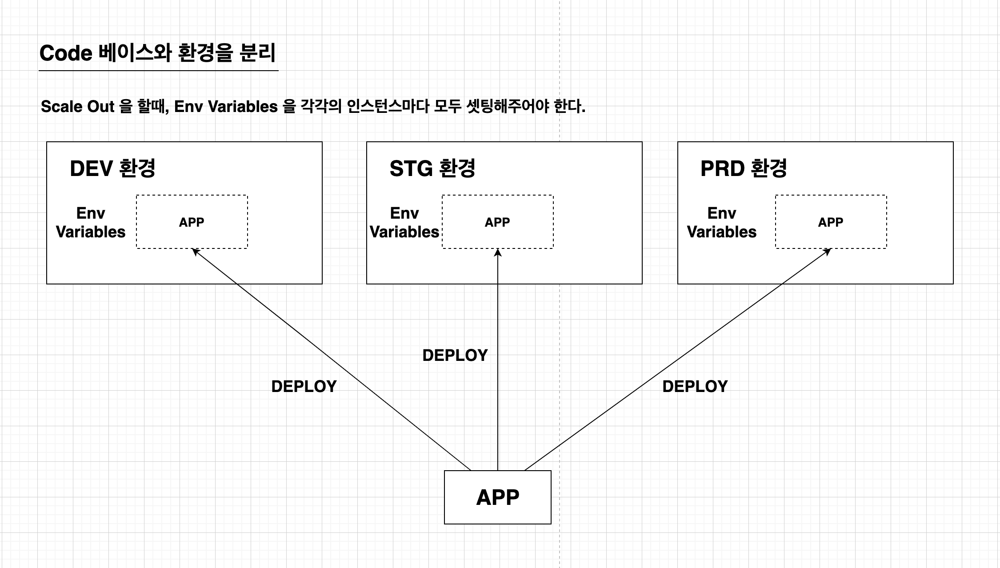
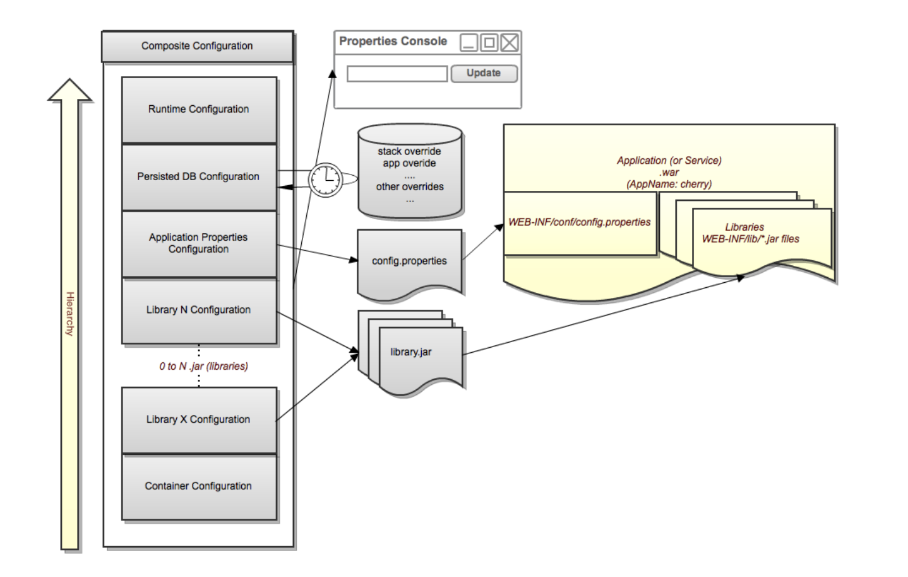

# Netflix Archaius 살펴보기

## 코드와 환경의 분리

* 코드와 환경을 분리하는 것은 왜 필요할까?
  * 서비스는 코드가 변경되지 않았지만, 환경에 따라서 설정들은 변경될 수 있다.
  * 이런 변하는 성질인 환경에 대한 정보를 코드 베이스와 분리해야한다.
  * 또, 민감한 환경 정보를 코드와 함께 관리할 수 없다. 코드가 만약 노출되어도 중요한 환경 정보가
  잘 분리되어있다면, 민감한 정보는 노출되지 않을 수 있다.
  * 만약에 스케일 아웃을 한다고 생각해보자.
  * 1000대의 인스턴스로 늘린다구 할 때, 이 인스턴스 각각에 모든 환경 변수를 하나씩 다 설정해주는 것은
  작업 공수가 늘어나는 일이다.
* 중앙에서 코드를 관리한다면 위와 같은 문제를 해결할 수 있다.




## Archaius Overview

* Archaius 는 여러 configuration 저장소로 부터 `동적 프로퍼티` 관리에 집중하는 라이브러리이다.
* 동적 프로퍼티란 무엇일까?
  * 프로퍼티가 변경되었을 때, 이를 적용하기 위해서 was 를 restart 해야한다.
  * 동적 프로퍼티로 관리하게 되면, 이러한 restart 없이 runtime 에 프로퍼티를 적용할 수 있다.
  * `Archaius` 는 카멜레온 이라고 하는데, 이러한 특징 때문에 카멜레온이라고 하는건 아닐까 (?)
* Archaius 의 주요 특징
  * 동적이고, 타입화된 프로퍼티
  * 높은 처리량 및 thread-safe 한 configuration 작업
  * `pooling framework` 로 configuration 이 변경 되었을 때 변경 사항을 얻을 수 있다.
  * JConsole 을 통해 액세스하여 프로퍼티에 대해 호출하고 프로퍼티 값을 확인할 수 있는 JMX MBean
  * 우선순위 순서에 따라서 configuration들을 합성하여 사용가능



* Archaius 의 핵심은 하나 이상의 configuration 을 보유할 수 있는 composite configuration
이다.
* 이게 도대체 무슨말일까?


## 주요 특징 좀 더 자세하게 살펴보기

* 오버뷰에서 간단하게 살펴본 주요 특징을 좀 더 자세하게 살펴보자.

### Dynamic properties

* Archaius 에서는 런타임에 동적으로 프로퍼티를 변경할 수 있다.
* 아래 예제 처럼 코드로 작성할 경우, 런타임에 프로퍼티를 변경한다는 것은 어려울 수 있다.

```
String prop = System.getProperty("myProperty");
  int x = DEFAULT_VALUE;
  try {
      x = Integer.parseInt(prop);
  } catch (NumberFormatException e) {
      // handle format issues
  }
  myMethod(x);
  // ...
```

* Archaius 를 이용하면, 코드가 더 깔끔하고, 동적으로 프로퍼티 또한 변경이 가능하다.

```
DynamicIntProperty prop =
    DynamicPropertyFactory.getInstance().getIntProperty("myProperty", DEFAULT_VALUE);
// prop.get() may change value at runtime
myMethod(prop.get());
```

* 또한, configuration 이 변경되었을 때, notification을 줄 수 있도록, Listener Callback 도
제공한다.

```
prop.addCallback(new Runnable() {
     public void run() {
         // ...
     }
 });
```

* 위와 같은 콜백이 있으면, 설정 변화가 생겼을 때, log 를 남길 수 있지 않을까 생각된다.

### A polling framework for dynamic configuration sources

* 고정된 interval 시간에, DynamicPropertyFactory 는 클래스패스에 __사전 정의된 로컬 파일__ 과
system property 에 __정의된 URL 원격지에서 configuration 들을 로드한다.__
* Archaius는 또한 JDBC 기반의 Configuration source 구현도 제공한다. -> (?)
* 또 직접 polling 에 관한 스케줄러를 구현하여서 설정할 수 있다.
* 아래 예제를 살펴보면, polling 에 대한 스케줄을 커스텀하게 설정할 수 있을 듯 하다.

```
PolledConfigurationSource source = createMyOwnSource();
AbstractPollingScheduler scheduler = createMyOwnScheduler();
ConfigurationManager.install(new DynamicConfiguration(source, scheduler));
```

### Ready for use configuration sources

* Archaius 는 현재 두가지 유용한 configuration source 구현체를 갖고 있다.
* `com.netflix.config.sources.JDBCConfigurationSource` 는 프로퍼티를 JDBC 를 통해서
데이터베이스에서 받아올 수 있다.
* `com.netflix.config.sources.DynamoDbConfigurationSource` 는 Amazon DynamoDB 에
정의된 테이블에서 properties 정보들을 받아올 수 있다.

### Configuration and deployment context management

* `com.netflix.config.ConfigurationManager` 는 시스템 전체 configuration 및 배포 컨텍스트를
관리하는 central manager 이다.

### High throughput and thread-safe configurations

* Archaius 는 properties 을 읽고 쓰고 이벤트를 동시에 실행할 수 있는 `Apache’s Common Configuration` 을 확장한
configuration 들의 셋트를 제공한다.
  * 그렇다는 것은..Archaius 에서 properties 들을 갱신하거나 할 때 병목을 유발하지는 않는 다는 것 같다.
  * 대신에 내부 스레드풀을 써서 처리를 할 듯. 구현은 확인이 필요하다.


### 참고링크

* https://github.com/Netflix/archaius/wiki/Overview
