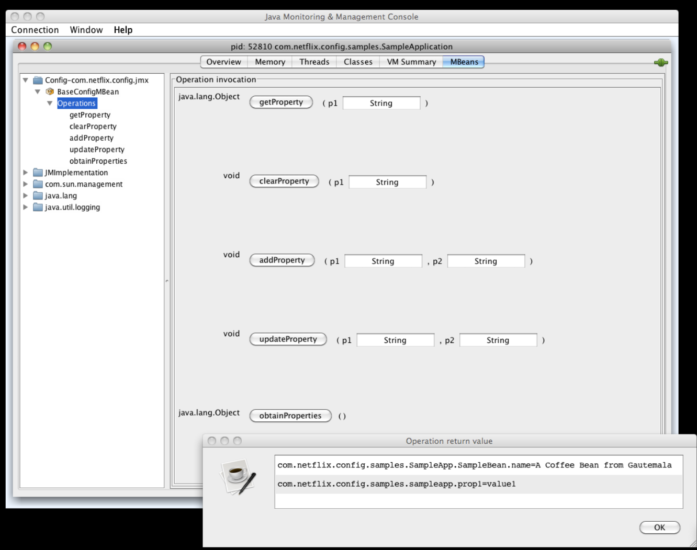

# Archaius User Guide

* 이 문서는 Archaius의 특정 고급 기능을 사용하는 방법을 설명한다.

## Provide your own configuration source or polling scheduler

* 이전 섹션에서 설명했지만, Archaius 는 기본적으로 URL을 configuration source 로
사용하여, 고정된 delay 로 폴링을 한다.
* 그러나, 자신만의 configuration source 를 만들어서 사용할 수 있고, 물론 폴링 스케줄러도
직접 구현하여 커스텀할 수 있다.
* 예를 들어서, 자신의 관계형 데이터베이스, 분산 키-밸류 스토어, 카산드라, 아마존의 Simple DB
등의 자신만의 configuration source 를 정의할 수도 있다.
* 이러한 경우에는 아래와 같은 순서를 따라서 진행한다.

### STEP

* 1) `com.netflix.config.PolledConfigurationSource` 를 구현한다.

```
public class DBConfigurationSource implements PolledConfigurationSource {
    // ...
    @Override
    public PollResult poll(boolean initial, Object checkPoint)
            throws Exception {
        // implement logic to retrieve properties from DB
    }  
}
```

* 2) (Optional) `com.netflix.config.AbstractScheduler` 를 확장한 scheduler 를 제공한다.

```
public class MyScheduler extends AbstractPollingScheduler {
    // ...
    @Override
    protected synchronized void schedule(Runnable runnable) {
        // schedule the runnable
    }

    @Override
    public void stop() {
        // stop the scheduler
    }
}
```
* 3) `com.netflix.config.DynamicConfiguration` 인스턴스를 생성한다.

```
PolledConfigurationSource source = ...
AbstractPollingScheduler scheduler = ...
DynamicConfiguration configuration = new DynamicConfiguration(source, scheduler);
```

* 4) `com.netflix.config.ConfigurationManager` 이용해서 configuration 을 등록

```
ConfigurationManager.install(configuration);
```

* 5) `com.netflix.config.DynamicPropertyFactory` 를 통해서 property 값 생성

```
DynamicStringProperty myprop = DynamicPropertyFactory.getInstance().getStringProperty(...);
```

* 6) (Optional) default configuration source 설정을 끈다
  * DynamicPropertyFactory가 getInstance 를 호출 시 URL 기반 default confiugration 을
  사용하지 않도록 설정할 수 있다.

```
archaius.dynamicProperty.disableDefaultConfig=true
```

### 런타임에 properties 를 업데이트하고 보기 위해서 JConsole 을 이용

* 아래와 같은 system property 를 설정하면, `DynamicPropertyFactory`에 등록된 설정이
자동적으로 JMX 에 노출되고, 그리고 jconsole 을 통해서 properties 를 업데이트할 수 있다.

```
archaius.dynamicPropertyFactory.registerConfigWithJMX=true
```

* 대안적으로, 코드로 MBean 을 사용해서 자신의 configuration 을 프로그래밍 방식으로도
등록할 수 있다.

```
AbstractConfiguration config = ...
ConfigJMXManager.registerConfigMbean(config);
```



* 위 이미지는 `obtainProperties()` 오퍼레이션이 호출 될 때 properties 들이 나오는 화면을
캡쳐한 것이다.
* 가능한 오퍼레이션은 아래와 같다.
  * `obtainProperties` : composite configuration 안에 있는 모든 properties 를 가져온다.
  * `getProperty(key)` : key 에 매칭되는 특정한 property 값을 가져온다
  * `addPropery(String key, String value)`: 새로운 property 를 compositeConfiguration 에 추가한다.
  * `updatePropery(String key, String value)`: 존재하는 property 를 업데이트한다.
  * clearProeprty(String key): property 를 삭제한다.

### Using ConfigurationManager

* configuration manager 는 중앙에 위치에서 전체적인 system configuration 을 관리한다.
* 만약에 자신이 직접 `AbstractConfiguration` 을 구현하여 configuration 관리를 한다면,
`AbstractConfiguration`으로 `DynamicPropertyFactory` 를 초기화 하는 `ConfigurationManager`로
설치할 수 있다.
* 만약에 어플리케이션에서 어떠한 프로그래밍 방식으로 configuration 이 구성되어 있지 않다면,
기본적으로는 default system property 와 DynamicURLConfiguration 이 설치 될 것이다.
* deployment context는 앱의 배포와 관련된 속성들이 포함된다.
* 예를 들어서, `DeploymentContext.getDeploymentEnvironment()`는 어떤 환경인지에 대한 값을
반환할 것이다.
* 이런 값에는 예를 들어 "dev", "stg", "prd" 등이 있을 것이다.
* 이런 기능은 환경에 맞춘 properties 를 정의하기에 유용하다.
* 만약에 어떤 deployment context 가 ConfigurationManager 에 프로그래밍적으로 설정이
되어있지 않다면, 기본적으로 `ConfigurationBasedDeploymentContext`가 설치될 것이다.
* 이 ConfigurationBasedDeploymentContext 안에 있는 Apis 들의 반환 값은 `ConfigurationManager`
로 부터 설치된 configuration 값들을 기반으로 한다.


### 참고링크

* https://github.com/Netflix/archaius/wiki/Users-Guide
